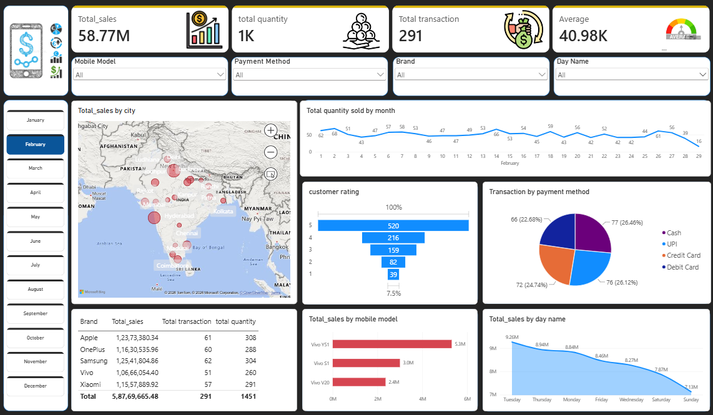

# 📱 Mobile Sales Analysis Dashboard | Power BI

## 📊 Project Overview

This project is an interactive **Mobile Sales Analysis Dashboard** created using **Microsoft Power BI**.

The dashboard provides a comprehensive view of mobile sales performance, including total sales, quantity sold, transactions, customer ratings, payment methods, mobile models, brands, cities, and sales trends over time.

The main goal of this project is to transform raw mobile sales data into meaningful and interactive business insights using Power BI.

---

## 🖼️ Dashboard Preview

---

## 🎯 Project Objectives

- Analyze overall mobile sales performance
- Track total sales and quantity sold
- Analyze sales by city
- Identify sales trends by month and day
- Compare different mobile brands and models
- Analyze customer ratings
- Understand payment method preferences
- Provide interactive filtering for better analysis
- Build a clean and user-friendly business dashboard

---

## 📌 Key KPIs

The dashboard includes the following key performance indicators:

- 💰 **Total Sales:** 58.77M
- 📦 **Total Quantity:** 1.45K
- 🧾 **Total Transactions:** 291
- 📊 **Average Transaction Value:** 40.98K

---

## 📈 Dashboard Features

### 🗺️ Sales by City

The map visualization displays mobile sales across different cities, helping identify geographical sales distribution.

### 📅 Monthly Sales Analysis

The monthly trend chart shows how the quantity of mobile phones sold changes throughout the month.

### ⭐ Customer Rating Analysis

Customer ratings are analyzed using a visual distribution from 1 to 5 stars.

### 💳 Payment Method Analysis

The dashboard provides a breakdown of transactions by payment method:

- Cash
- UPI
- Credit Card
- Debit Card

### 📱 Sales by Mobile Model

The dashboard compares sales performance across different mobile models.

### 🏷️ Brand Analysis

The dashboard provides brand-level analysis including:

- Total Sales
- Total Transactions
- Total Quantity

### 📆 Sales by Day

Sales are also analyzed based on the day of the week to identify daily sales patterns.

---

## 🎛️ Interactive Filters

The dashboard contains multiple interactive filters that allow users to analyze the data dynamically.

### Available Filters

- 📱 Mobile Model
- 💳 Payment Method
- 🏷️ Brand
- 📅 Day Name
- 📆 Month

Users can select different values from these filters to dynamically update the dashboard visuals.

---

## 🛠️ Tools & Technologies

| Tool | Purpose |
|------|---------|
| **Power BI** | Dashboard development and visualization |
| **Power Query** | Data cleaning and transformation |
| **DAX** | Measures and calculations |
| **Microsoft Bing Maps** | Geographical sales visualization |

---

## 🧮 Power BI Concepts Used

This project demonstrates practical usage of:

- Data Cleaning
- Data Transformation
- Data Modeling
- DAX Measures
- Calculated Columns
- KPI Cards
- Slicers
- Filters
- Maps
- Line Charts
- Bar Charts
- Funnel Charts
- Pie/Donut Charts
- Tables
- Interactive Dashboard Design

---

## 📊 Dashboard Insights

The dashboard can be used to analyze:

- Which mobile brands generate higher sales
- Which mobile models contribute most to revenue
- Which cities have higher sales
- Which payment methods are commonly used
- Customer rating distribution
- Monthly sales trends
- Daily sales performance
- Transaction volume across different categories

---
